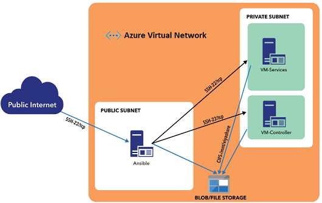

# SAS Infrastructure-Only Quickstart Template for Azure

[](https://portal.azure.com/#create/Microsoft.Template/uri/https%3A%2F%2Fraw.githubusercontent.com%2Fsassoftware%2Fazure-quickstart-templates%2Fdevelop-resources-only%2Fsas-viya-resources-only%2Fazuredeploy.json)
[](http://armviz.io/#/?load=https%3A%2F%2Fraw.githubusercontent.com%2Fsassoftware%2Fazure-quickstart-templates%2Fdevelop-resources-only%2Fsas-viya-resources-only%2Fazuredeploy.json)

This Quickstart is a reference architecture for users wanting to create a configurable, base set of Viya-ready resources in Azure. 

For assistance with SAS software, contact  [SAS Technical Support](https://support.sas.com/en/technical-support.html). When you contact support, you will be required to provide information, such as your SAS site number, company name, email address, and phone number, that identifies you as a licensed SAS software customer. 
 
## Contents
- [SAS Infrastructure-Only Quickstart Template for Azure](#sas-infrastructure-only-quickstart-template-for-azure)
  - [Contents](#contents)
  - [Overview](#overview)
  - [Architecture](#architecture)
  - [Prerequisites](#prerequisites)
  - [Resource Sizing Options](#resource-sizing-options)
  - [Template Parameters](#template-parameters)
  - [Deployment Steps](#deployment-steps)
  - [Post-deployment Details](#post-deployment-details)
      - [Obtaining the Ansible Controller Public IP](#ansible-controller-public-ip)
      - [User Accounts](#user-accounts)
      - [Logging Into the VMs](#logging-into-vms)
  - [Costs and Licenses](#costs-and-licenses)
  - [Best Practices for Deployments on Azure](#best-practices)
  - [Troubleshooting](#troubleshooting)
  - [Appendix A: Security Considerations](#appendix-a-security-considerations)
    - [Network Security Groups](#network-security-groups)
  - [Appendix B: Customer Attribution](#appendix-b-customer-attribution)
    - [Notification for Resource Manager Template Deployments](#notification-for-resource-manager-template-deployments)
  - [Appendix C: Additional Resources](#appendix-c-additional-resources)

<a name="overview"></a>
## Overview

The purpose of this Quickstart is to create a customizable set of Azure resources which can serve as an infrastructure onto which SAS Viya components can be readily installed.

The Quickstart provides the ability to select among several predetermined groups of resource options such as VM sizing (vCPU, memory, etc.), number of data disks, storage type, and accelerated networking.  

In addition, when this template is deployed the Microsoft Usage Attribution GUID is applied, allowing Microsoft to associate any SAS software installed with the Azure resources being consumed. More information can be found at [Azure customer usage attribution](https://docs.microsoft.com/en-us/azure/marketplace/azure-partner-customer-usage-attribution).

<a name="architecture"></a>
## Architecture

The SAS Infrastructure-Only Quickstart Template creates the virtual machines, networking resources, and other associated infrastructure necessary to support the intallation of SAS Viya.

When the Quickstart is deployed with the default template parameters, the following environment is created in the specified Azure resource group:



When completed, the Quickstart will create the following Azure resources: 
* 1 VM for administration and software installation -- the Ansible controller
* 1 compute VM -- the Cloud Analytic Services (CAS) controller (see note below)
* 1 VM for the SAS Viya services -- the Services controller
* 1 Azure VNet, and 2 subnets (one public, one private)
* NICs and IP addresses for the VMs
* Storage account for shared files
* Network security groups

Initially the Ansible controller is the only VM that is configured to allow external access, however SSH access is configured between it and the other VMs. Also, Ansible is installed on this VM, as well as other software installation tools (python, pip, yum) making it a suitable base from which to provision the other VMs. 

All of the non-Ansible VMs are minimally configured -- SSH and Ansible access has been set up, and the shared storage account has been mounted. 

**Note:** If the template parameter **CAS Node Count** is greater than 1, that number of CAS workers are configured *in addition* to the CAS controller (more on this in a following section).

<a name="prerequisites"></a>
## Prerequisites
Before deploying SAS Infrastructure-Only Quickstart Template for Azure, you must have the following:
* Azure user account with Contributor and Admin Roles
* Sufficient quota of at least 28 Cores, based on four licensed SAS cores in an SMP environment.  In MPP environments, apply this sizing to the CAS workers as well as the CAS controller.
* A resource group that does not already contain a Quickstart deployment. For more information, see [Resource groups](https://docs.microsoft.com/en-us/azure/azure-resource-manager/resource-group-overview#resource-groups).


<a name="resource-sizing-options"></a>
## Resource Sizing Options
This Quickstart provides the ability specify the overall sizing of provisioned resources using a single template parameter, named **resourceProfile**. 

Each possible value for this parameter represents a predetermined group of sizing options for VMs, networking, and storage. The following shows the resource options that correspond to each value:   

| resourceProfile | Ansible VM    | CAS, Services, Worker | Accelerated Networking | Data Disk Type | Data Disk Size | Data Disk Count |
| -------------   | ------------- | -------------         | -------------          | ------------- |-------------    | -------------   |
|basic            | Standard_B2s  | Standard_E8s_v3       | no                     | Premium_LRS   | 256 GB          | 1 |
|memOptimized1    | Standard_B2s  | Standard_E16s_v3      | yes                    | Premium_LRS   | 1024 GB         | 4 |
|memOptimized2    | Standard_B2s  | Standard_E32s_v3      | yes                    | Premium_LRS   | 1024 GB         | 4 |
|storageOptimized | Standard_B2s  | Standard_L16s_v2      | yes                    | Premium_LRS   | 1024 GB         | 3 |


<a name="template-parameters"></a>
## Template Parameters
Prior to launching the Quickstart, the template provides the opportunity to supply deployment parameters. Those with default values are optional, and those without defaults are required. The following parameters are supported:

* **SSHPublicKey**
  * Description: The public SSH key that will be used to log into the VMs.
  * Type: string
  * Default: *none*
* **location**
  * Description: The location in Microsoft Azure where these resources should be created.
  * Type: string
  * Default: \<the location of the designated resource group\>
* **AdminIngressLocation**
  * Description: Allow inbound SSH traffic to the Ansible Controller from this CIDR block (IP address range). Must be a valid IP CIDR range of the form x.x.x.x/x.
  * Type: string
  * Default: *none*
* **CAS Node Count**
  * Description: The number of CAS nodes in the deployment. If this is set to 1, an SMP environment is built with one CAS controller. If this is set to a value of 2 or more, an MPP environment is built (n workers + 1 controller).
  * Type: int
  * Default: 1
  * Allowed values: 1-10
* **_artifactsLocationSasToken**
  * Description: For a standard deployment, leave empty. If you are running from a blob template, then provide the Shared Access Signature token (starting with a ?) that grants authorization to the private template.
  * Type: securestring 
  * Default: empty
* **_artifactsLocation**
  * Description: For a standard deployment, keep the default. The HTTPS URL to the base of the deployment files in Microsoft Azure (if a SAS token is needed, do not include the token in the URL).
  * Type: string
  * Default: \<the project's URL in Azure\>
* **resourceProfile**
  * Description: Used to specify a set of resource sizing and configuration values.
  * Allowed values: *basic*, *memOptimized1*, *memOptimized2*, *storageOptimized*
  * Default: basic


<a name="deployment-steps"></a>
## Deployment Steps
To deploy the template, click the "Deploy to Azure" button at the top of this document, or follow the instructions for a command-line (CLI) deployment using the scripts in the root of this repository.

The deployment takes approximately 10-20 minutes to complete.


<a name="post-deployment-details"></a>
## Post-deployment Details

<a name="ansible-controller-public-ip"></a>
### Obtaining the Ansible Controller Public IP
The public IP address of the Ansible controller can be obtained by clicking **Outputs** in the left panel of the finished deployment.

<a name="useraccounts"></a>
### User Accounts
The *vmuser* host operating system account is created during deployment. Use this account to log in via SSH to any of the VMs.

<a name="logging-into-vms"></a>
### Logging Into the VMs

The *vmuser* account has been created on all the VMs, however, all access must must go through the Ansible controller since it is the only VM configured with a public IP address. To connect to VMs through the Ansible controller:
1. Log in to the controller as *vmuser*:
```
ssh -i <full-path-to-private-key> vmuser@<ansible-controller-public-ip>
```

2. From the Ansible controller, connect to the services, CAS controller, and worker VMs as *vmuser*:
```
ssh vmuser@services
ssh vmuser@controller
ssh vmuser@worker01
ssh vmuser@worker02
```

<a name="costs"></a>
### Costs and Licenses
You are responsible for the cost of any licensed SAS software and the Azure services used while running this Quickstart deployment. There is no additional cost for using the Quickstart.
Your SAS account team and the SAS Enterprise Excellence Center can advise on the appropriate software licensing and sizing to meet workload and performance needs.


<a name="best-practices"></a>
## Best Practices for Deployments on Azure
We recommend the following as best practices:
* Create a separate resource group for each Quickstart deployment. For more information, see [Resource groups](https://docs.microsoft.com/en-us/azure/azure-resource-manager/resource-group-overview#resource-groups).
* In resource groups that contain a Quickstart deployment, include only the Quickstart deployment in the resource group to facilitate the deletion of the deployment as a unit.


<a name="troubleshooting"></a>
## Troubleshooting
* If your deployment fails, review the failed deployment steps and see 
["Deployment errors"](https://docs.microsoft.com/en-us/azure/azure-resource-manager/resource-manager-common-deployment-errors#deployment-errors) in the Azure troubleshooting documentation.

* If the deployment succeeds, but you encounter issues regarding the software that was installed, review the log file /var/log/sas/install/runSetupHostForAnsible.log which resides on the Ansible controller.


<a name="appendix-a-security-considerations"></a>
## Appendix A: Security Considerations

<a name="network-security-groups"></a>
### Network Security Groups 
SAS Infrastructure-Only Quickstart Template for Azure creates the following network security groups to control access to the servers sources outside the virtual network. All server to server communication between subnets in the virtual network is permitted.

| Name   | Ingress Rules| Egress Rules | Servers/Load Balancers | Notes |
| ------------- | ------------- | ------------- | ------------- | ------------- |
|AnsibleController_NetworkSecurityGroup  | Allow port 22/TCP from CIDR prefix specified in the "AdminIngressLocation" parameter. Deny all others.| Allow All  | Ansible |Ansible controller can be connected to through SSH only.   |
| Viya_NetworkSecurityGroup |	Deny All |	Allow All |Services Controller |	No external connections can be directly made to the SAS Viya servers. 


<a name="appendix-b-customer-attribution"></a>
## Appendix B: Customer Attribution

<a name="notification-for-resource-manager-template-deployments"></a>
### Notification for Resource Manager Template Deployments
When you deploy this template, Microsoft is able to identify the installation of SAS software with the Azure resources that are deployed. Microsoft is able to correlate the Azure resources that are used to support the software. Microsoft collects this information to provide the best experiences with their products and to operate their business. The data is collected and governed by Microsoft's privacy policies, which can be found at [Microsoft Trust Center](https://www.microsoft.com/trustcenter).

<a name="appendix-c-additional-resources"></a>
## Appendix C: Additional Resources

[SAS Viya 3.5 for Linux: Deployment Guide](https://go.documentation.sas.com/?docsetId=dplyml0phy0lax&docsetTarget=soe.htm&docsetVersion=3.5&locale=en)

[Best Practices for Using Microsoft Azure with SAS](https://communities.sas.com/t5/Administration-and-Deployment/Best-Practices-for-Using-Microsoft-Azure-with-SAS/m-p/676833#M19680)
